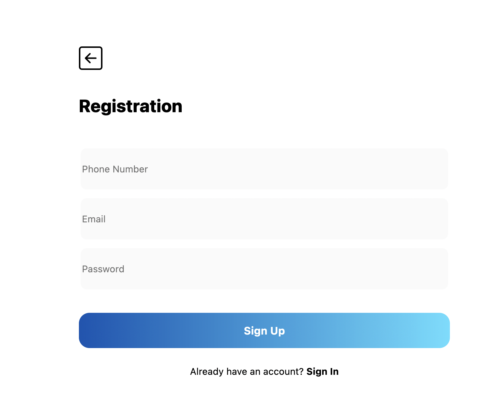

# Flycoin Partner API Documentation

## Introduction

Welcome to the Flycoin Partner API! You can use our API to access Flycoin Partner API endpoints, which can get information on accounts, connect your external accounts to Flycoin accounts, and give FLY to connected accounts.

We have language bindings in Shell! You can view code examples in the dark area to the right.

## Getting Started

In order to get started, you'll need:

* An API Key
* API Docs

### Creating Flycoin Accounts with your API Key

The first step is to link an account on your site to an account on the Flycoin server by generating a claim link (see [Generating a Claim Link](./#generating-a-claim-link)). Once you've followed the generated link, you'll see this page if you aren't currently logged into a Flycoin account: 

If you are already logged into a Flycoin account, then you will be redirected to the dashboard page. You've now successfully linked a Flycoin account to your Partner account. 
<aside class="notice"> There is no limit to the number of accounts a partner can link to Flycoin.</aside>

### Retrieving Accounts

Now that you've created an account, you can view how the account is represented in the Flycoin database (see [Account](./#account)). To view a specific account, see [Get Account Information](./#get-account-information). You can see all of the transactions associated with that account as well as their current balances.

### Give Rewards to an Account

Finally, you can give FLY from your Partner account on Flycoin to one of the linked accounts. Create a POST request and specify the currency, the amount, and a description of the transaction (see [Give Rewards](./#assign-rewards-to-an-account))

## Authentication

> To authorize, use this code:

```shell
# With shell, you can just pass the correct cookie with each request
curl "api_endpoint_here" \
  -b "fly-partner-api-key: YOUR-KEY-HERE"
```

> Make sure to replace `YOUR-KEY-HERE` with your API key.

The Flycoin Partner API uses API keys to allow access.

Flycoin expects for the API key to be included in all API requests to the server in a cookie that looks like the following:

`fly-partner-api-key: YOUR-KEY-HERE`

<aside class="notice">
You must replace <code>YOUR-KEY-HERE</code> with your personal API key.
</aside>

## Partner API Requests

### Get Account Information

```shell
curl "https://app-flycoin.onrender.com/api/v1/partner/account/<partner_identifier_key>" \
  -b "fly-partner-api-key: YOUR-KEY-HERE"
```

```php
$ch = curl_init();
curl_setopt($ch, CURLOPT_URL, 'https://app-flycoin.onrender.com/api/v1/partner/account/<partner_identifier_key>');
curl_setopt($ch, CURLOPT_RETURNTRANSFER, true);
curl_setopt($ch, CURLOPT_CUSTOMREQUEST, 'GET');
curl_setopt($ch, CURLOPT_HTTPHEADER, [
]);
curl_setopt($ch, CURLOPT_COOKIE, 'fly-partner-api-key: YOUR-KEY-HERE');

$response = curl_exec($ch);

curl_close($ch);
```

```python
import requests

cookies = {
    'fly-partner-api-key: YOUR-KEY-HERE': '',
}

headers = {
    # 'Cookie': 'fly-partner-api-key: YOUR-KEY-HERE',
}

response = requests.get('https://app-flycoin.onrender.com/api/v1/partner/account/<partner_identifier_key>', headers=headers, cookies=cookies)
```

```javascript
fetch('https://app-flycoin.onrender.com/api/v1/partner/account/<partner_identifier_key>', {
    headers: {
        'Cookie': 'fly-partner-api-key: YOUR-KEY-HERE'
    }
});
```

> The above command returns JSON structured like this:

```json
{
  "balances": [
    {
      "account_id": 1,
      "amount": 42,
      "created_at": "2022-03-22 16:25:10.534898-07:00",
      "currency_id": 1,
      "deleted_at": null,
      "id": 1,
      "updated_at": "2022-03-22 16:25:10.534898-07:00"
    }
  ],
  "created_at": "2022-03-22 16:25:10.534898-07:00",
  "deleted_at": null,
  "id": 1,
  "is_partner": true,
  "transaction_history": [
    {
      "id": 39,
      "created_at": "2022-03-28T15:51:32.286385-07:00",
      "updated_at": "2022-03-28T15:51:32.290481-07:00",
      "deleted_at": null,
      "account_id": 9,
      "reference_account_id": 0,
      "currency_id": 2,
      "currency":{
        "id": 2,
        "currency_name": "FLY"
      },
      "amount": 42,
      "usd_cent_exchange_rate": 0,
      "kind": "Rewards",
      "description": "signup reward",
      "resulting_balance": 0,
      "public_address": ""
    }
  ],
  "updated_at": "2022-03-22 16:25:10.534898-07:00"
}
```

This endpoint retrieves the account associated with ```<partner_identifier_key>```

#### HTTP Request

`GET https://app-flycoin.onrender.com/api/v1/partner/account/<partner_identifier_key>`

#### Query Parameters

Parameter | Description
--------- | -----------
partner_identifier_key | This is an identifier associated with a Flycoin account.

### Assign Rewards to an Account

```shell
curl "https://app-flycoin.onrender.com/api/v1/partner/rewards/<partner_identifier_key>" \
  -X POST \
  -b "fly-partner-api-key: YOUR-KEY-HERE"
  -d "{'amount': 100, 'currency': 'FLY', 'description': 'Rewards for user sign-up'}"
```

```php
$ch = curl_init();
curl_setopt($ch, CURLOPT_URL, 'https://app-flycoin.onrender.com/api/v1/partner/rewards/<partner_identifier_key>');
curl_setopt($ch, CURLOPT_RETURNTRANSFER, true);
curl_setopt($ch, CURLOPT_CUSTOMREQUEST, 'POST');
curl_setopt($ch, CURLOPT_HTTPHEADER, [
]);
curl_setopt($ch, CURLOPT_COOKIE, 'fly-partner-api-key: YOUR-KEY-HERE');

$response = curl_exec($ch);

curl_close($ch);
```

```python
import requests

cookies = {
    'fly-partner-api-key: YOUR-KEY-HERE': '',
}

headers = {
    # 'Cookie': 'fly-partner-api-key: YOUR-KEY-HERE',
}

response = requests.post('https://app-flycoin.onrender.com/api/v1/partner/rewards/<partner_identifier_key>', headers=headers, cookies=cookies)
```

```javascript
fetch('https://app-flycoin.onrender.com/api/v1/partner/rewards/<partner_identifier_key>', {
    method: 'POST',
    headers: {
        'Cookie': 'fly-partner-api-key: YOUR-KEY-HERE'
    }
});
```

> The above command returns JSON structured like this:

```json
{
  "message": "success"
}
```

This endpoint assigns a specific amount of currency to an account.

#### HTTP Request

`POST https://app-flycoin.onrender.com/api/v1/partner/rewards/<partner_identifier_key>`

#### URL Parameters

Parameter | Description
--------- | -----------
partner_identifier_key | This is an identifier associated with a Flycoin account.

### Generating a Claim Link

```shell
curl "https://app-flycoin.onrender.com/api/v1/partner/claim/generate_link/<partner_identifier_key>" \
  -X POST \
  -b "fly-partner-api-key: YOUR-KEY-HERE"
```

```php
$ch = curl_init();
curl_setopt($ch, CURLOPT_URL, 'https://app-flycoin.onrender.com/api/v1/partner/claim/generate_link/<partner_identifier_key>');
curl_setopt($ch, CURLOPT_RETURNTRANSFER, true);
curl_setopt($ch, CURLOPT_CUSTOMREQUEST, 'POST');
curl_setopt($ch, CURLOPT_HTTPHEADER, [
]);
curl_setopt($ch, CURLOPT_COOKIE, 'fly-partner-api-key: YOUR-KEY-HERE');

$response = curl_exec($ch);

curl_close($ch);
```

```python
import requests

cookies = {
    'fly-partner-api-key: YOUR-KEY-HERE': '',
}

headers = {
    # 'Cookie': 'fly-partner-api-key: YOUR-KEY-HERE',
}

response = requests.post('https://app-flycoin.onrender.com/api/v1/partner/claim/generate_link/<partner_identifier_key>', headers=headers, cookies=cookies)
```

```javascript
fetch('https://app-flycoin.onrender.com/api/v1/partner/claim/generate_link/<partner_identifier_key>', {
    method: 'POST',
    headers: {
        'Cookie': 'fly-partner-api-key: YOUR-KEY-HERE'
    }
});
```

> The above command returns JSON structured like this:

```json
{
  "message": "success",
  "claim_link": "https://app-flycoin.onrender.com/login?claim_code=ClaimToken"
}
```

<aside class="notice"> The claim code is 10 characters long and contains only [a-z,A-z,0-9]</aside>
This endpoint creates a link to Flycoin that is used to link an external account with a Flycoin account. Once the link has been
clicked, you will be redirected to the Flycoin website and either be asked to login/signup or if you're already signed in, that account
will be linked.

#### HTTP Request

`POST https://app-flycoin.onrender.com/api/v1/partner/claim/generate_link/<partner_identifier_key>`

#### URL Parameters

Parameter | Description
--------- | -----------
partner_identifier_key | This is an identifier associated with a Flycoin account.

### Get Top Balances

```shell
curl "https://app-flycoin.onrender.com/api/v1/partner/top/<currency_name>/<count>" \
  -b "fly-partner-api-key: YOUR-KEY-HERE"
```

```php
$ch = curl_init();
curl_setopt($ch, CURLOPT_URL, 'https://app-flycoin.onrender.com/api/v1/partner/top/<currency_name>/<count>');
curl_setopt($ch, CURLOPT_RETURNTRANSFER, true);
curl_setopt($ch, CURLOPT_CUSTOMREQUEST, 'GET');
curl_setopt($ch, CURLOPT_HTTPHEADER, [
]);
curl_setopt($ch, CURLOPT_COOKIE, 'fly-partner-api-key: YOUR-KEY-HERE');

$response = curl_exec($ch);

curl_close($ch);
```

```python
import requests

cookies = {
    'fly-partner-api-key: YOUR-KEY-HERE': '',
}

headers = {
    # 'Cookie': 'fly-partner-api-key: YOUR-KEY-HERE',
}

response = requests.get('https://app-flycoin.onrender.com/api/v1/partner/top/<currency_name>/<count>', headers=headers, cookies=cookies)
```

```javascript
fetch('https://app-flycoin.onrender.com/api/v1/partner/top/<currency_name>/<count>', {
    headers: {
        'Cookie': 'fly-partner-api-key: YOUR-KEY-HERE'
    }
});
```

> The above command returns JSON structured like this:

```json
[
  {
    "partner_identifier_key": "example_key_0",
    "value": 90.39
  },
  {
    "partner_identifier_key": "example_key_1",
    "value": 1000
  },
  {
    "partner_identifier_key": "example_key_2",
    "value": 0.01
  },
]
```

This endpoint retrieves a list of partner_identifier_keys of the highest ranking flycoin holders associated with the partner.

#### HTTP Request

`GET https://app-flycoin.onrender.com/api/v1/partner/top/<currency_name>/<count>`

#### URL Parameters

Parameter | Description
--------- | -----------
currency_name | The name of the currency to compare
count | The number of the top accounts to retrieve